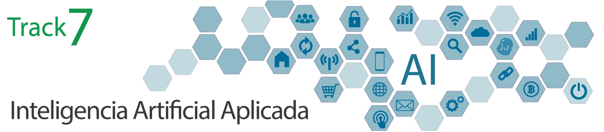

# WALC_2022-Applied_AI
WALC 2022 - Panama - Track 7 – Inteligencia Artificial Aplicada

## Material 
- All material will be uploaded to this repo at the classes' base
  - Slides, Noteboooks, Code and Docs in English 
  - Videos in Spanish

### Day_1:
+ [[Slides]](day_1/) 
+ [[Morning Video]](https://youtu.be/J1d94Vrtj_E)
+ [[Afternoon Video]](https://youtu.be/OHizFg1WWK4)
### Day_2:
+ [[Slides]](day_2/) 
+ [[Morning Video]](https://youtu.be/NisQSkHd-SQ)
+ [[Afternoon Video]](https://youtu.be/OTSOHNKk8Ok)
### Day_3:
+ [[Slides]](day_3/) 
+ [[Morning Video]]()
+ [[Afternoon Video]]()
### Day_4:
+ [[Slides]](day_4/) 
+ [[Morning Video]]()
+ [[Afternoon Video]]()
### Day_5:
+ [[Slides]](day_5/) 
+ [[Morning Video]]()
+ [[Afternoon Video]]()
